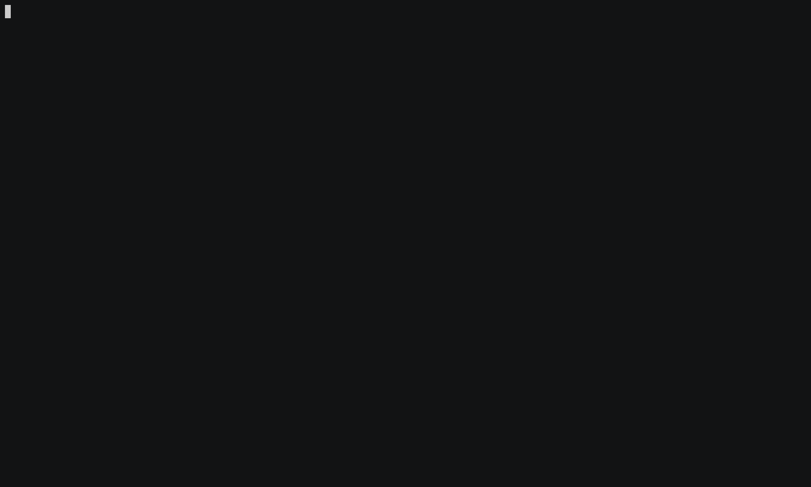
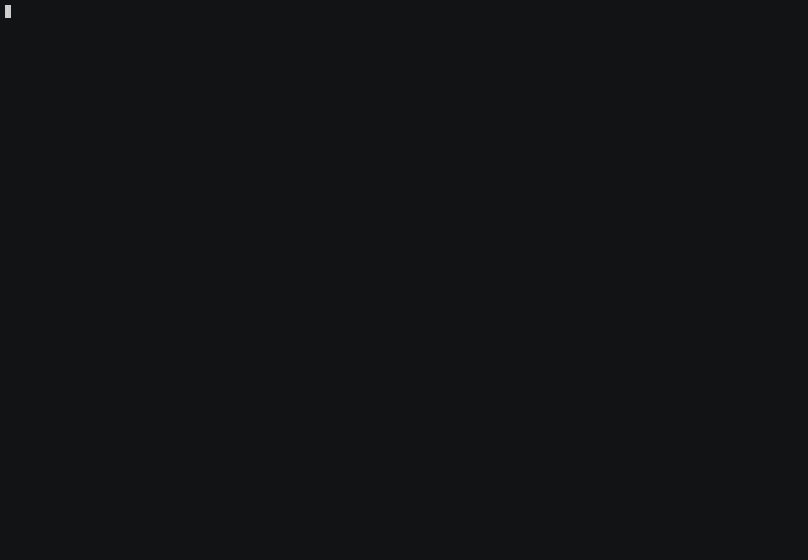

# lsk

Imagine ls, but you can 'key' into the file or dir instead of just starring at it.

It's experimental. At the momement, only files and dirs are differentiated by hard-coded colors, so you can't see if a file is executable or something.



## Install

You'll need rust installed.

```
cargo install lsk
```

## Optional (highly recommended) setup and deps

lsk works out-of-the-box, but you may consider the following.

### xdotool

You'll need xdotool installed to use `w` and `r` commands. Find it on your favorite package manager for your system.

### envronmental variables

To open files with your prefered editor using $EDITOR env var, do something like

`export EDITOR="vim"`

otherwise it will default to nano editor when opening up files.

To open any file using $LSK_FILE_OPENER

`export LSK_FILE_OPENER="<favorite-file-opener>"`

If unset, it uses xdg-open to open random files, such as pics or music files.

## Usage

For the equivalent of `ls -a`, do `lsk -a`. Other useful options like ls has aren't yet supported, but it's a goal.

### Inside lsk

The rationale is you can just punch in the key number + Enter. That 90% of it. To go back a dir, punch `0`.

Here's all the important ones. Note some of the commands below require a space.

**open file with editor**: `<key>`

**open dir**: `<key>`

**open any file**: `o <key>` (default is xdg-open)

**search/fuzzy-widdle the list:** `s ` (remember the space and then type)

**Go back a dir:** `0`

**Quite:** `q`

**Work in viewed dir:** `w` (sort-a-like `cd`)

**Select range of files:** `<key_start>-<key_end>` (e.g. `7-5`)

**Return file/dir paths:** `r <key1> <key2> [...]` (e.g. `r 1 2 3`)

**Next-page:** `<key>-` (e.g. For example `49-` if there are more than 48 results on current page page.)

**Original-page** `0-` (Don't confuse with `0`, which is goes back a directory level)

## Goals

* Publish to crates.io.

* Interactive help.

* If xdotool isn't found, print returned files or directory paths.

* Docker and nix installation for non-rust users.

* Test on MacOS and maybe see about Windows compatibility.

* Add more file colors (only file and dir differentiated right now).

* LS_COLOR support and don't rely on hard-coding color scheme.

* Add async and do more pass-by-reference: it's slow if there are a ton of files in the top of directory.

* Edit a command without having to rely solely on backspace.

* Cursor (blinky thing that moves when you type) should be visible.

* Escape a file view from widdling-down or selecting a range.

* Maybe figure out an alternative to xdo-tool (using env var to return file names is sorta hacky).

* Use more screen real-estate and handle file name wraps.

## Other usage

If you like tools like `fzf`, you may like this. You can run lsk with scripts you make (bash, python, etc) for fuzzy directory jumping, fuzzy file opening, and fuzzy commands (very experimental).

`c` is for command.



####  Fuzzy dir

`lsk --fuzzy-dir /path/to/fuzzy/dir/script`

Here's my script I use personally.

```
#!/bin/bash

find -type d | cut -c 3- | fzf
```

#### Fuzzy file open

`lsk --fuzzy-find /path/to/fuzzy/file/open/script`

The script I use.

```
#!/bin/bash

fzf
```

You can pass all these args together and alias it to `lsk` for your convenience.

`lsk --fuzzy-dir /path/to/fuzzy/dir/script --fuzzy-find /path/to/fuzzy/file/open/script`

## Development

### Testing

At the moment, some tests must be ran on host while others in docker. lsk's tests simulates keyboard input and I can't figure out how to do that in docker.

**Run tests for host or docker**

Stage code changes, if any. It's very important that you do this.

`git add -u`

Run the following scripts, which uncomment #[ignore] for either host or docker tests.

`./unignore_host_tests` or `./unignore_host_tests`

Run tests on host.

`cargo test -- --test-threads=1 --nocapture`
Run tests on docker, using dev script.

`./dev.sh test rust-lib`

***Undo any unstaged changes (those are the 'unignore' script)***

`git restore .`

#### Special cases

For an unknown reason, these test only run if 'asked' to explicitly.

`./dev.sh test rust-lib list`

One or more tests rely on exact terminal size.

`./unignore_host_term_size_dependent`
